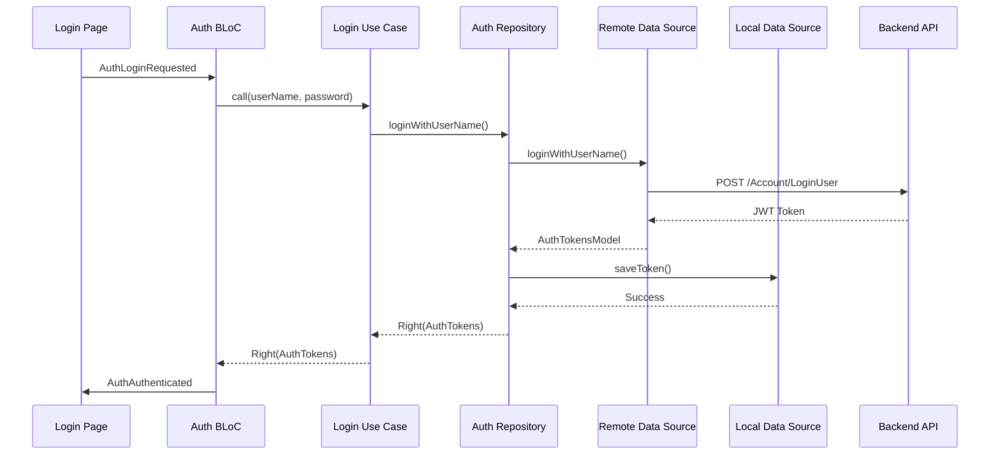
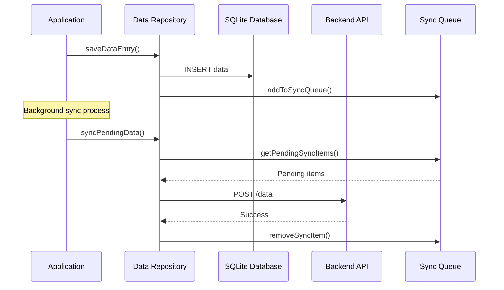

# Architecture Documentation

## Overview

The SPB Secure Flutter application follows **Clean Architecture** principles, ensuring separation of concerns, testability, and maintainability. This document provides a comprehensive overview of the architectural decisions, patterns, and structure.

## Architecture Principles

### 1. Clean Architecture

The application is structured in layers with clear dependencies:

```
┌─────────────────────────────────────┐
│           Presentation              │
│     (UI, BLoC, Pages, Widgets)     │
└─────────────────┬───────────────────┘
                  │
┌─────────────────▼───────────────────┐
│             Domain                  │
│   (Entities, Use Cases, Repos)     │
└─────────────────┬───────────────────┘
                  │
┌─────────────────▼───────────────────┐
│              Data                   │
│  (Repositories, Data Sources, APIs) │
└─────────────────┬───────────────────┘
                  │
┌─────────────────▼───────────────────┐
│              Core                   │
│    (Utils, Config, DI, Network)    │
└─────────────────────────────────────┘
```

### 2. Dependency Rule

Dependencies point inward:
- **Presentation** depends on **Domain**
- **Data** depends on **Domain**
- **Domain** depends on nothing (pure business logic)
- **Core** provides infrastructure for all layers

### 3. Single Responsibility Principle

Each class and module has a single, well-defined responsibility:
- **Entities**: Business objects
- **Use Cases**: Business logic operations
- **Repositories**: Data access abstractions
- **Data Sources**: Concrete data implementations
- **BLoCs**: State management and UI logic

## Layer Details

### Core Layer

The core layer provides foundational services and utilities used across the application.

#### Configuration Management
```dart
// Environment-aware configuration
class EnvironmentConfig {
  static Environment get currentEnvironment;
  static String get baseUrl;
  static bool get isLoggingEnabled;
  static Duration get timeout;
}
```

#### Dependency Injection
```dart
// Service locator pattern with get_it
final getIt = GetIt.instance;

@InjectableInit()
Future<void> configureDependencies() async {
  // Register dependencies
}
```

#### Network Layer
```dart
// HTTP client with interceptors
class DioClient {
  static Dio createDio() {
    return Dio()
      ..interceptors.addAll([
        AuthInterceptor(),
        ErrorInterceptor(),
        LoggingInterceptor(),
      ]);
  }
}
```

#### Error Handling
```dart
// Structured error handling
abstract class Failure extends Equatable {
  final String message;
  const Failure(this.message);
}

class NetworkFailure extends Failure {
  const NetworkFailure(super.message);
}
```

### Domain Layer

Pure business logic without external dependencies.

#### Entities
```dart
// Business objects
class User extends Equatable {
  final String id;
  final String userName;
  final String email;
  final String name;
  
  const User({
    required this.id,
    required this.userName,
    required this.email,
    required this.name,
  });
}
```

#### Use Cases
```dart
// Business operations
class LoginUseCase {
  final AuthRepository repository;
  
  LoginUseCase(this.repository);
  
  Future<Either<Failure, AuthTokens>> call(
    String userName, 
    String password,
  ) async {
    // Validation and business logic
    return await repository.loginWithUserName(userName, password);
  }
}
```

#### Repository Interfaces
```dart
// Data access contracts
abstract class AuthRepository {
  Future<Either<Failure, AuthTokens>> loginWithUserName(
    String userName, 
    String password,
  );
  Future<Either<Failure, void>> logout();
  Future<bool> isLoggedIn();
}
```

### Data Layer

Concrete implementations of domain contracts.

#### Repository Implementations
```dart
class AuthRepositoryImpl implements AuthRepository {
  final AuthRemoteDataSource remoteDataSource;
  final AuthLocalDataSource localDataSource;
  
  AuthRepositoryImpl({
    required this.remoteDataSource,
    required this.localDataSource,
  });
  
  @override
  Future<Either<Failure, AuthTokens>> loginWithUserName(
    String userName,
    String password,
  ) async {
    try {
      final tokens = await remoteDataSource.loginWithUserName({
        'userName': userName,
        'password': password,
      });
      
      await localDataSource.saveToken(tokens.accessToken);
      return Right(tokens);
    } catch (e) {
      return Left(ServerFailure('Login failed'));
    }
  }
}
```

#### Data Sources
```dart
// Remote data source
abstract class AuthRemoteDataSource {
  Future<AuthTokensModel> loginWithUserName(Map<String, dynamic> credentials);
  Future<void> logout();
}

// Local data source
abstract class AuthLocalDataSource {
  Future<void> saveToken(String accessToken);
  Future<String?> getAccessToken();
  Future<void> clearToken();
}
```

#### Models
```dart
// Data transfer objects
@JsonSerializable()
class AuthTokensModel extends AuthTokens {
  const AuthTokensModel({required super.accessToken});
  
  factory AuthTokensModel.fromJson(Map<String, dynamic> json) => 
      _$AuthTokensModelFromJson(json);
  
  Map<String, dynamic> toJson() => _$AuthTokensModelToJson(this);
}
```

### Presentation Layer

UI components and state management.

#### BLoC Pattern
```dart
// State management
class AuthBloc extends Bloc<AuthEvent, AuthState> {
  final LoginUseCase loginUseCase;
  final LogoutUseCase logoutUseCase;
  
  AuthBloc({
    required this.loginUseCase,
    required this.logoutUseCase,
  }) : super(const AuthInitial()) {
    on<AuthLoginRequested>(_onAuthLoginRequested);
    on<AuthLogoutRequested>(_onAuthLogoutRequested);
  }
  
  Future<void> _onAuthLoginRequested(
    AuthLoginRequested event,
    Emitter<AuthState> emit,
  ) async {
    emit(const AuthLoading());
    
    final result = await loginUseCase(event.userName, event.password);
    
    result.fold(
      (failure) => emit(AuthError(failure.message)),
      (tokens) => emit(AuthAuthenticated(user: extractUser(tokens))),
    );
  }
}
```

#### Pages and Widgets
```dart
// UI components
class LoginPage extends StatelessWidget {
  const LoginPage({super.key});
  
  @override
  Widget build(BuildContext context) {
    return BlocListener<AuthBloc, AuthState>(
      listener: (context, state) {
        if (state is AuthAuthenticated) {
          context.go('/home');
        } else if (state is AuthError) {
          ScaffoldMessenger.of(context).showSnackBar(
            SnackBar(content: Text(state.message)),
          );
        }
      },
      child: const LoginForm(),
    );
  }
}
```

## Design Patterns

### 1. Repository Pattern

Abstracts data access logic and provides a clean API for the domain layer.

```dart
// Domain layer interface
abstract class UserRepository {
  Future<Either<Failure, User>> getCurrentUser();
  Future<Either<Failure, void>> updateUser(User user);
}

// Data layer implementation
class UserRepositoryImpl implements UserRepository {
  final UserRemoteDataSource remoteDataSource;
  final UserLocalDataSource localDataSource;
  
  // Implementation details...
}
```

### 2. Use Case Pattern

Encapsulates business logic in single-purpose classes.

```dart
class GetCurrentUserUseCase {
  final UserRepository repository;
  
  GetCurrentUserUseCase(this.repository);
  
  Future<Either<Failure, User>> call() async {
    return await repository.getCurrentUser();
  }
}
```

### 3. BLoC Pattern

Manages application state and business logic presentation.

```dart
// Events
abstract class UserEvent extends Equatable {}

class UserLoadRequested extends UserEvent {
  const UserLoadRequested();
}

// States
abstract class UserState extends Equatable {}

class UserLoading extends UserState {}
class UserLoaded extends UserState {
  final User user;
  const UserLoaded(this.user);
}

// BLoC
class UserBloc extends Bloc<UserEvent, UserState> {
  final GetCurrentUserUseCase getCurrentUserUseCase;
  
  UserBloc({required this.getCurrentUserUseCase}) : super(UserInitial()) {
    on<UserLoadRequested>(_onUserLoadRequested);
  }
}
```

### 4. Dependency Injection

Uses service locator pattern for dependency management.

```dart
// Registration
getIt.registerLazySingleton<AuthRepository>(
  () => AuthRepositoryImpl(
    remoteDataSource: getIt<AuthRemoteDataSource>(),
    localDataSource: getIt<AuthLocalDataSource>(),
  ),
);

// Usage
final authRepository = getIt<AuthRepository>();
```

### 5. Factory Pattern

Creates objects without specifying exact classes.

```dart
class DioClient {
  static Dio createDio() {
    final dio = Dio(BaseOptions(
      baseUrl: EnvironmentConfig.baseUrl,
      timeout: EnvironmentConfig.timeout,
    ));
    
    dio.interceptors.addAll([
      AuthInterceptor(),
      ErrorInterceptor(),
      LoggingInterceptor(),
    ]);
    
    return dio;
  }
}
```

## Data Flow

### 1. User Interaction Flow

```
User Input → Widget → BLoC Event → Use Case → Repository → Data Source → API
                ↓
User Interface ← Widget ← BLoC State ← Use Case ← Repository ← Data Source ← Response
```

### 2. Authentication Flow



### 3. Data Synchronization Flow



## Security Architecture

### 1. Authentication Security

- **JWT Token Storage**: Secure storage using platform-specific encryption
- **Token Validation**: Automatic expiration checking and cleanup
- **Interceptor Security**: Automatic token attachment and refresh

### 2. Data Security

- **Local Encryption**: Sensitive data encrypted in SQLite
- **Secure Storage**: Critical data stored using Flutter Secure Storage
- **Network Security**: HTTPS enforcement in production

### 3. API Security

- **Request Signing**: JWT tokens for API authentication
- **Error Handling**: Structured error responses without sensitive data exposure
- **Rate Limiting**: Client-side and server-side rate limiting

## Performance Considerations

### 1. Memory Management

- **Lazy Loading**: Dependencies loaded on-demand
- **Stream Disposal**: Proper cleanup of streams and controllers
- **Image Caching**: Efficient image loading and caching

### 2. Database Performance

- **Indexing**: Proper database indexes for query performance
- **Pagination**: Large datasets loaded in chunks
- **Background Operations**: Heavy database operations on background threads

### 3. Network Performance

- **Request Caching**: Intelligent caching of API responses
- **Retry Logic**: Exponential backoff for failed requests
- **Connection Pooling**: Efficient HTTP connection management

## Testing Architecture

### 1. Unit Testing

- **Domain Layer**: Pure business logic testing
- **Use Cases**: Input/output validation
- **Repositories**: Mock data source testing

### 2. Widget Testing

- **UI Components**: Widget behavior and rendering
- **BLoC Testing**: State management testing
- **Integration**: Widget and BLoC interaction

### 3. Integration Testing

- **End-to-End**: Complete user flows
- **API Integration**: Real API communication
- **Database Integration**: Data persistence testing

## Scalability Considerations

### 1. Modular Architecture

- **Feature Modules**: Independent feature development
- **Shared Core**: Reusable infrastructure components
- **Plugin Architecture**: Easy addition of new features

### 2. State Management

- **BLoC Isolation**: Feature-specific state management
- **Global State**: Shared state for cross-cutting concerns
- **State Persistence**: Critical state preservation

### 3. Code Organization

- **Layer Separation**: Clear architectural boundaries
- **Dependency Management**: Controlled dependency flow
- **Code Generation**: Automated boilerplate reduction

## Future Enhancements

### 1. Microservices Support

- **Service Discovery**: Dynamic service endpoint resolution
- **Circuit Breaker**: Fault tolerance for service calls
- **Load Balancing**: Intelligent request distribution

### 2. Offline-First Architecture

- **Conflict Resolution**: Data synchronization conflict handling
- **Event Sourcing**: Event-based data management
- **CQRS**: Command Query Responsibility Segregation

### 3. Real-time Features

- **WebSocket Integration**: Real-time data updates
- **Push Notifications**: Background notification handling
- **Live Collaboration**: Multi-user real-time features

This architecture provides a solid foundation for building scalable, maintainable, and testable Flutter applications while following industry best practices and clean architecture principles.