# Technical Diagrams

## System Architecture

### High-Level Architecture

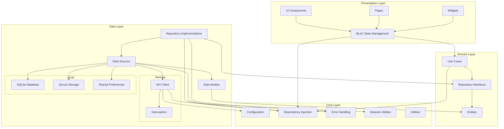
```mermaid
graph TD
    subgraph "Presentation Layer"
        UI[UI Components]
        Pages[Pages]
        Widgets[Widgets]
        BLoC[BLoC State Management]
    end
    
    subgraph "Domain Layer"
        Entities[Entities]
        UseCases[Use Cases]
        Repositories[Repository Interfaces]
    end
    
    subgraph "Data Layer"
        RepoImpl[Repository Implementations]
        DataSources[Data Sources]
        Models[Data Models]
        
        subgraph "Remote"
            API[API Client]
            Interceptors[Interceptors]
        end
        
        subgraph "Local"
            DB[SQLite Database]
            SecureStorage[Secure Storage]
            SharedPrefs[Shared Preferences]
        end
    end
    
    subgraph "Core Layer"
        Config[Configuration]
        DI[Dependency Injection]
        Error[Error Handling]
        Network[Network Utilities]
        Utils[Utilities]
    end
    
    UI --> BLoC
    Pages --> BLoC
    Widgets --> BLoC
    BLoC --> UseCases
    UseCases --> Repositories
    Repositories --> Entities
    RepoImpl --> Repositories
    RepoImpl --> DataSources
    DataSources --> Models
    Models --> Entities
    API --> Interceptors
    DataSources --> API
    DataSources --> DB
    DataSources --> SecureStorage
    DataSources --> SharedPrefs
    BLoC --> DI
    UseCases --> DI
    RepoImpl --> DI
    DataSources --> DI
    API --> Network
    RepoImpl --> Error
    API --> Config
```

### Clean Architecture Layers

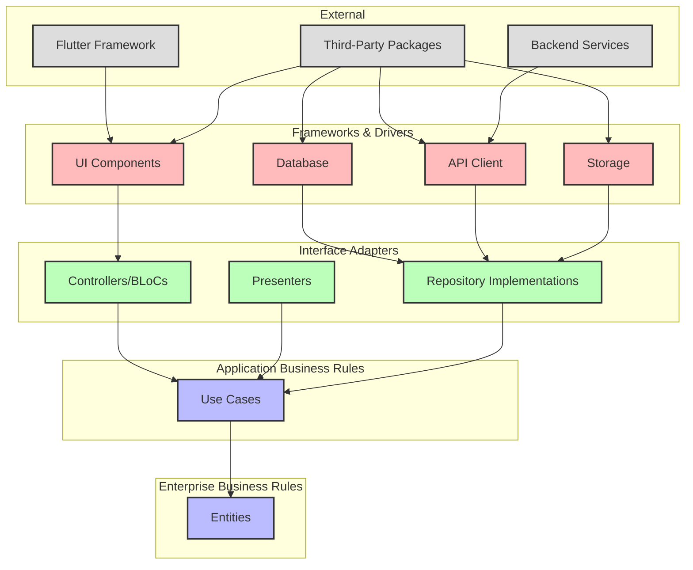
```mermaid
graph TD
    subgraph "External"
        Flutter[Flutter Framework]
        Packages[Third-Party Packages]
        Backend[Backend Services]
    end
    
    subgraph "Frameworks & Drivers"
        UI[UI Components]
        DB[Database]
        API[API Client]
        Storage[Storage]
    end
    
    subgraph "Interface Adapters"
        Controllers[Controllers/BLoCs]
        Presenters[Presenters]
        Gateways[Repository Implementations]
    end
    
    subgraph "Application Business Rules"
        UseCases[Use Cases]
    end
    
    subgraph "Enterprise Business Rules"
        Entities[Entities]
    end
    
    Flutter --> UI
    Packages --> UI
    Packages --> DB
    Packages --> API
    Packages --> Storage
    Backend --> API
    
    UI --> Controllers
    DB --> Gateways
    API --> Gateways
    Storage --> Gateways
    
    Controllers --> UseCases
    Presenters --> UseCases
    Gateways --> UseCases
    
    UseCases --> Entities
    
    classDef core fill:#f9f,stroke:#333,stroke-width:2px
    classDef domain fill:#bbf,stroke:#333,stroke-width:2px
    classDef data fill:#bfb,stroke:#333,stroke-width:2px
    classDef presentation fill:#fbb,stroke:#333,stroke-width:2px
    classDef external fill:#ddd,stroke:#333,stroke-width:2px
    
    class Entities,UseCases domain
    class Gateways,Controllers,Presenters data
    class UI,DB,API,Storage presentation
    class Flutter,Packages,Backend external
```

## Component Interactions

### Authentication Flow

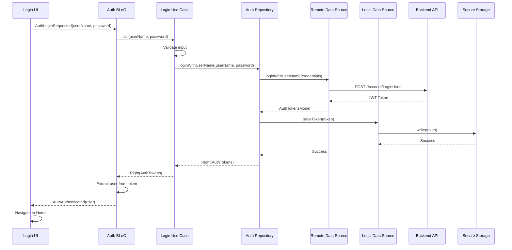
```mermaid
sequenceDiagram
    participant UI as Login UI
    participant BLoC as Auth BLoC
    participant UseCase as Login Use Case
    participant Repo as Auth Repository
    participant Remote as Remote Data Source
    participant Local as Local Data Source
    participant API as Backend API
    participant SecStore as Secure Storage
    
    UI->>BLoC: AuthLoginRequested(userName, password)
    BLoC->>UseCase: call(userName, password)
    UseCase->>UseCase: Validate input
    UseCase->>Repo: loginWithUserName(userName, password)
    Repo->>Remote: loginWithUserName(credentials)
    Remote->>API: POST /Account/LoginUser
    API-->>Remote: JWT Token
    Remote-->>Repo: AuthTokensModel
    Repo->>Local: saveToken(token)
    Local->>SecStore: write(token)
    SecStore-->>Local: Success
    Local-->>Repo: Success
    Repo-->>UseCase: Right(AuthTokens)
    UseCase-->>BLoC: Right(AuthTokens)
    BLoC->>BLoC: Extract user from token
    BLoC-->>UI: AuthAuthenticated(user)
    UI->>UI: Navigate to Home
```

### Data Synchronization Flow

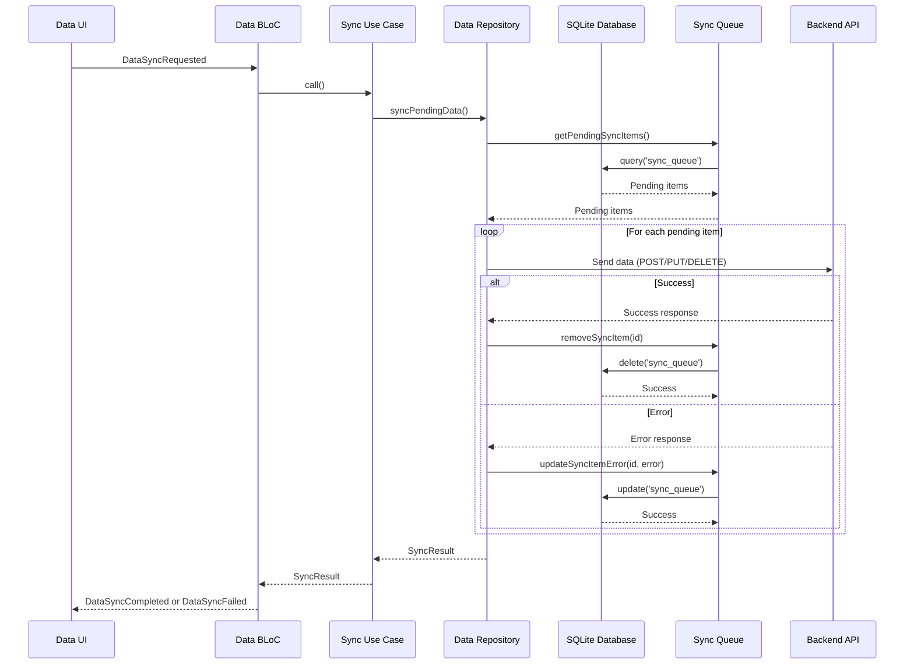
```mermaid
sequenceDiagram
    participant UI as Data UI
    participant BLoC as Data BLoC
    participant UseCase as Sync Use Case
    participant Repo as Data Repository
    participant DB as SQLite Database
    participant Queue as Sync Queue
    participant API as Backend API
    
    UI->>BLoC: DataSyncRequested
    BLoC->>UseCase: call()
    UseCase->>Repo: syncPendingData()
    Repo->>Queue: getPendingSyncItems()
    Queue->>DB: query('sync_queue')
    DB-->>Queue: Pending items
    Queue-->>Repo: Pending items
    
    loop For each pending item
        Repo->>API: Send data (POST/PUT/DELETE)
        alt Success
            API-->>Repo: Success response
            Repo->>Queue: removeSyncItem(id)
            Queue->>DB: delete('sync_queue')
            DB-->>Queue: Success
        else Error
            API-->>Repo: Error response
            Repo->>Queue: updateSyncItemError(id, error)
            Queue->>DB: update('sync_queue')
            DB-->>Queue: Success
        end
    end
    
    Repo-->>UseCase: SyncResult
    UseCase-->>BLoC: SyncResult
    BLoC-->>UI: DataSyncCompleted or DataSyncFailed
```

### Network Request Flow

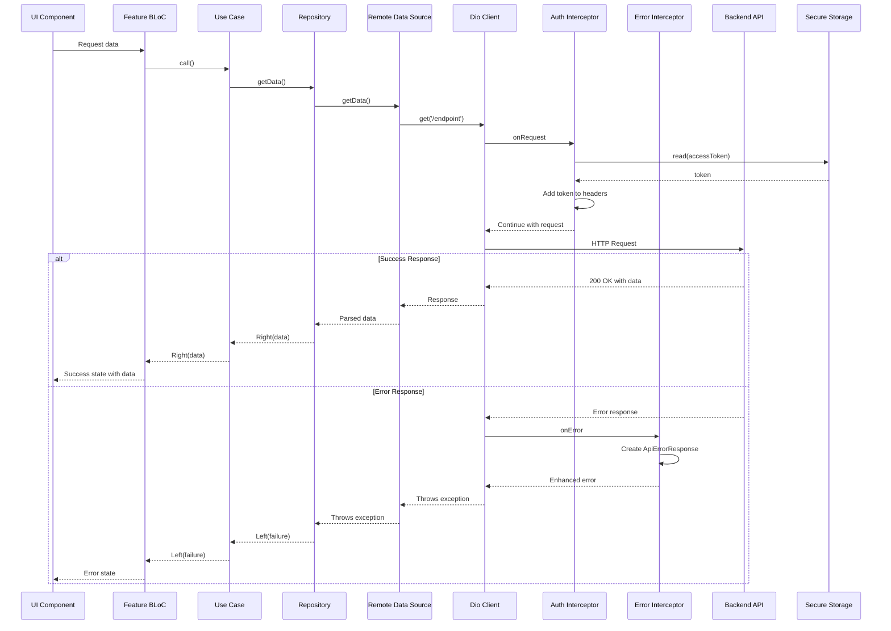
```mermaid
sequenceDiagram
    participant UI as UI Component
    participant BLoC as Feature BLoC
    participant UseCase as Use Case
    participant Repo as Repository
    participant DataSource as Remote Data Source
    participant Dio as Dio Client
    participant Auth as Auth Interceptor
    participant Error as Error Interceptor
    participant API as Backend API
    participant SecStore as Secure Storage
    
    UI->>BLoC: Request data
    BLoC->>UseCase: call()
    UseCase->>Repo: getData()
    Repo->>DataSource: getData()
    DataSource->>Dio: get('/endpoint')
    Dio->>Auth: onRequest
    Auth->>SecStore: read(accessToken)
    SecStore-->>Auth: token
    Auth->>Auth: Add token to headers
    Auth-->>Dio: Continue with request
    Dio->>API: HTTP Request
    
    alt Success Response
        API-->>Dio: 200 OK with data
        Dio-->>DataSource: Response
        DataSource-->>Repo: Parsed data
        Repo-->>UseCase: Right(data)
        UseCase-->>BLoC: Right(data)
        BLoC-->>UI: Success state with data
    else Error Response
        API-->>Dio: Error response
        Dio->>Error: onError
        Error->>Error: Create ApiErrorResponse
        Error-->>Dio: Enhanced error
        Dio-->>DataSource: Throws exception
        DataSource-->>Repo: Throws exception
        Repo-->>UseCase: Left(failure)
        UseCase-->>BLoC: Left(failure)
        BLoC-->>UI: Error state
    end
```

## Data Models

### Entity Relationship Diagram

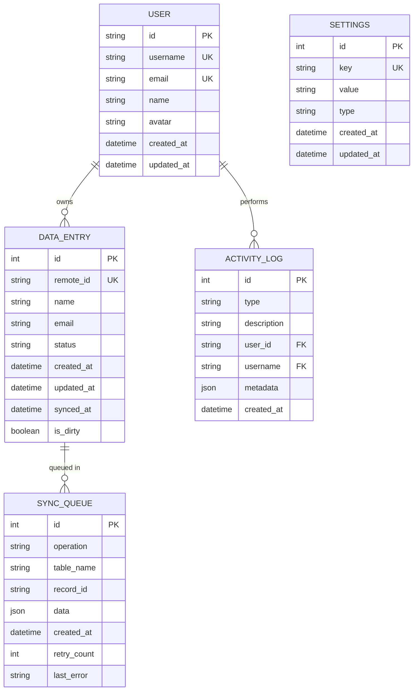
```mermaid
erDiagram
    USER {
        string id PK
        string username UK
        string email UK
        string name
        string avatar
        datetime created_at
        datetime updated_at
    }
    
    DATA_ENTRY {
        int id PK
        string remote_id UK
        string name
        string email
        string status
        datetime created_at
        datetime updated_at
        datetime synced_at
        boolean is_dirty
    }
    
    ACTIVITY_LOG {
        int id PK
        string type
        string description
        string user_id FK
        string username FK
        json metadata
        datetime created_at
    }
    
    SYNC_QUEUE {
        int id PK
        string operation
        string table_name
        string record_id
        json data
        datetime created_at
        int retry_count
        string last_error
    }
    
    SETTINGS {
        int id PK
        string key UK
        string value
        string type
        datetime created_at
        datetime updated_at
    }
    
    USER ||--o{ ACTIVITY_LOG : "performs"
    USER ||--o{ DATA_ENTRY : "owns"
    DATA_ENTRY ||--o{ SYNC_QUEUE : "queued in"
```

### Class Diagram: Authentication

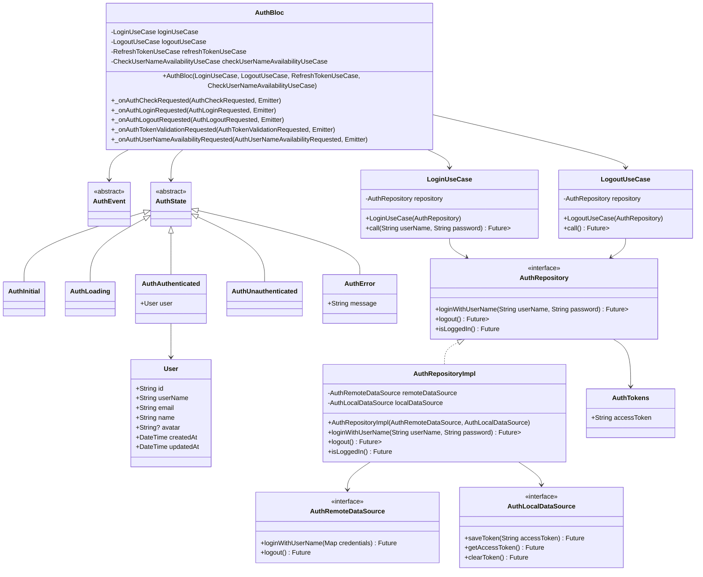
```mermaid
classDiagram
    class AuthBloc {
        -LoginUseCase loginUseCase
        -LogoutUseCase logoutUseCase
        -RefreshTokenUseCase refreshTokenUseCase
        -CheckUserNameAvailabilityUseCase checkUserNameAvailabilityUseCase
        +AuthBloc(LoginUseCase, LogoutUseCase, RefreshTokenUseCase, CheckUserNameAvailabilityUseCase)
        +_onAuthCheckRequested(AuthCheckRequested, Emitter)
        +_onAuthLoginRequested(AuthLoginRequested, Emitter)
        +_onAuthLogoutRequested(AuthLogoutRequested, Emitter)
        +_onAuthTokenValidationRequested(AuthTokenValidationRequested, Emitter)
        +_onAuthUserNameAvailabilityRequested(AuthUserNameAvailabilityRequested, Emitter)
    }
    
    class AuthEvent {
        <<abstract>>
    }
    
    class AuthState {
        <<abstract>>
    }
    
    class AuthInitial {
    }
    
    class AuthLoading {
    }
    
    class AuthAuthenticated {
        +User user
    }
    
    class AuthUnauthenticated {
    }
    
    class AuthError {
        +String message
    }
    
    class LoginUseCase {
        -AuthRepository repository
        +LoginUseCase(AuthRepository)
        +call(String userName, String password) Future<Either<Failure, AuthTokens>>
    }
    
    class LogoutUseCase {
        -AuthRepository repository
        +LogoutUseCase(AuthRepository)
        +call() Future<Either<Failure, void>>
    }
    
    class AuthRepository {
        <<interface>>
        +loginWithUserName(String userName, String password) Future<Either<Failure, AuthTokens>>
        +logout() Future<Either<Failure, void>>
        +isLoggedIn() Future<bool>
    }
    
    class AuthRepositoryImpl {
        -AuthRemoteDataSource remoteDataSource
        -AuthLocalDataSource localDataSource
        +AuthRepositoryImpl(AuthRemoteDataSource, AuthLocalDataSource)
        +loginWithUserName(String userName, String password) Future<Either<Failure, AuthTokens>>
        +logout() Future<Either<Failure, void>>
        +isLoggedIn() Future<bool>
    }
    
    class AuthRemoteDataSource {
        <<interface>>
        +loginWithUserName(Map<String, dynamic> credentials) Future<AuthTokensModel>
        +logout() Future<void>
    }
    
    class AuthLocalDataSource {
        <<interface>>
        +saveToken(String accessToken) Future<void>
        +getAccessToken() Future<String?>
        +clearToken() Future<void>
    }
    
    class User {
        +String id
        +String userName
        +String email
        +String name
        +String? avatar
        +DateTime createdAt
        +DateTime updatedAt
    }
    
    class AuthTokens {
        +String accessToken
    }
    
    AuthBloc --> AuthEvent
    AuthBloc --> AuthState
    AuthState <|-- AuthInitial
    AuthState <|-- AuthLoading
    AuthState <|-- AuthAuthenticated
    AuthState <|-- AuthUnauthenticated
    AuthState <|-- AuthError
    AuthBloc --> LoginUseCase
    AuthBloc --> LogoutUseCase
    LoginUseCase --> AuthRepository
    LogoutUseCase --> AuthRepository
    AuthRepository <|.. AuthRepositoryImpl
    AuthRepositoryImpl --> AuthRemoteDataSource
    AuthRepositoryImpl --> AuthLocalDataSource
    AuthAuthenticated --> User
    AuthRepository --> AuthTokens
```

## User Flows

### Login Flow

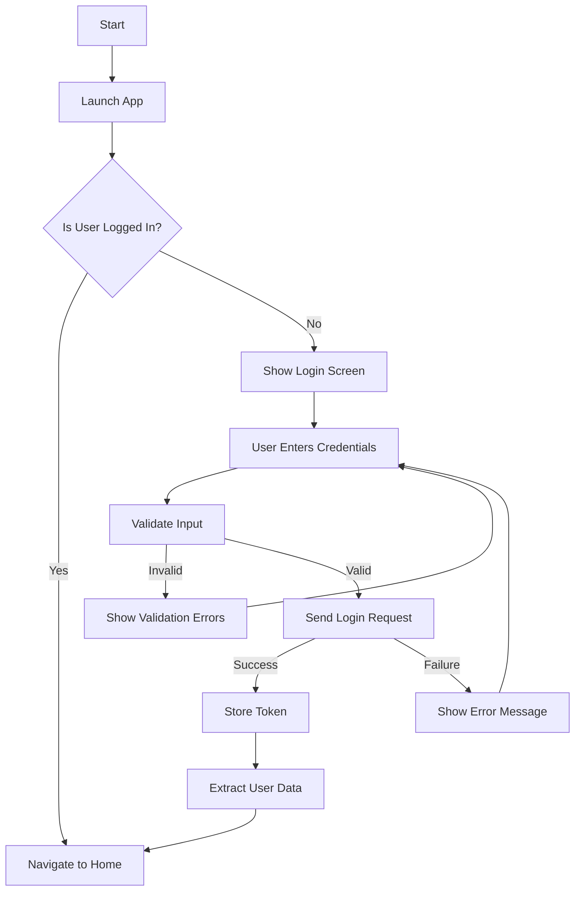
```mermaid
graph TD
    A[Start] --> B[Launch App]
    B --> C{Is User Logged In?}
    C -->|Yes| D[Navigate to Home]
    C -->|No| E[Show Login Screen]
    E --> F[User Enters Credentials]
    F --> G[Validate Input]
    G -->|Invalid| H[Show Validation Errors]
    H --> F
    G -->|Valid| I[Send Login Request]
    I -->|Success| J[Store Token]
    J --> K[Extract User Data]
    K --> D
    I -->|Failure| L[Show Error Message]
    L --> F
```

### Data Management Flow

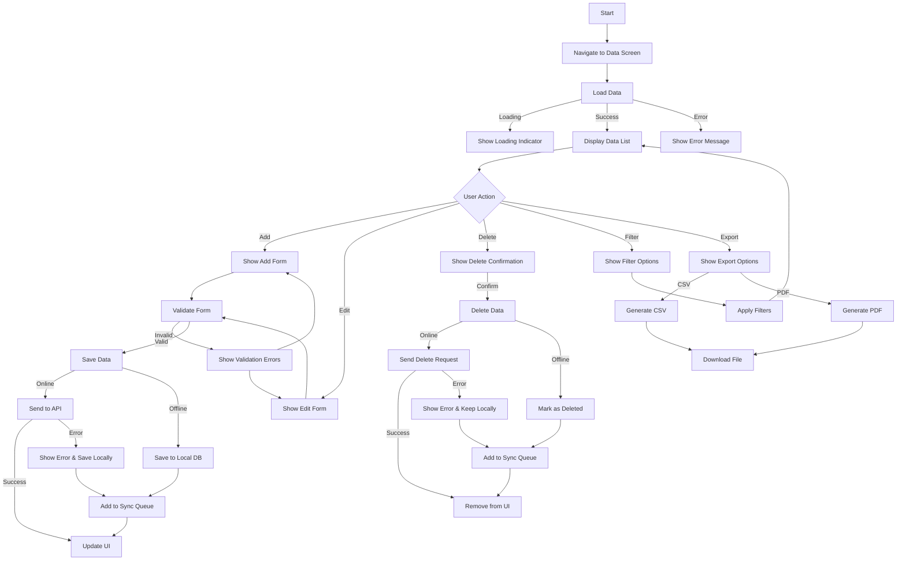
```mermaid
graph TD
    A[Start] --> B[Navigate to Data Screen]
    B --> C[Load Data]
    C -->|Loading| D[Show Loading Indicator]
    C -->|Success| E[Display Data List]
    C -->|Error| F[Show Error Message]
    
    E --> G{User Action}
    G -->|Add| H[Show Add Form]
    G -->|Edit| I[Show Edit Form]
    G -->|Delete| J[Show Delete Confirmation]
    G -->|Filter| K[Show Filter Options]
    G -->|Export| L[Show Export Options]
    
    H --> M[Validate Form]
    I --> M
    M -->|Invalid| N[Show Validation Errors]
    N --> H
    N --> I
    M -->|Valid| O[Save Data]
    O -->|Online| P[Send to API]
    O -->|Offline| Q[Save to Local DB]
    Q --> R[Add to Sync Queue]
    P -->|Success| S[Update UI]
    P -->|Error| T[Show Error & Save Locally]
    T --> R
    R --> S
    
    J -->|Confirm| U[Delete Data]
    U -->|Online| V[Send Delete Request]
    U -->|Offline| W[Mark as Deleted]
    W --> X[Add to Sync Queue]
    V -->|Success| Y[Remove from UI]
    V -->|Error| Z[Show Error & Keep Locally]
    Z --> X
    X --> Y
    
    K --> AA[Apply Filters]
    AA --> E
    
    L -->|CSV| AB[Generate CSV]
    L -->|PDF| AC[Generate PDF]
    AB --> AD[Download File]
    AC --> AD
```

## State Management

### Auth BLoC State Transitions

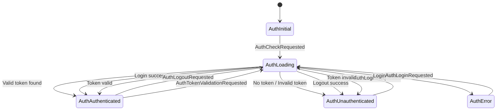
```mermaid
stateDiagram-v2
    [*] --> AuthInitial
    AuthInitial --> AuthLoading: AuthCheckRequested
    AuthLoading --> AuthAuthenticated: Valid token found
    AuthLoading --> AuthUnauthenticated: No token / Invalid token
    
    AuthUnauthenticated --> AuthLoading: AuthLoginRequested
    AuthLoading --> AuthAuthenticated: Login success
    AuthLoading --> AuthError: Login failure
    AuthError --> AuthLoading: AuthLoginRequested
    
    AuthAuthenticated --> AuthLoading: AuthLogoutRequested
    AuthLoading --> AuthUnauthenticated: Logout success
    
    AuthAuthenticated --> AuthLoading: AuthTokenValidationRequested
    AuthLoading --> AuthUnauthenticated: Token invalid
    AuthLoading --> AuthAuthenticated: Token valid
```

### Theme BLoC State Transitions

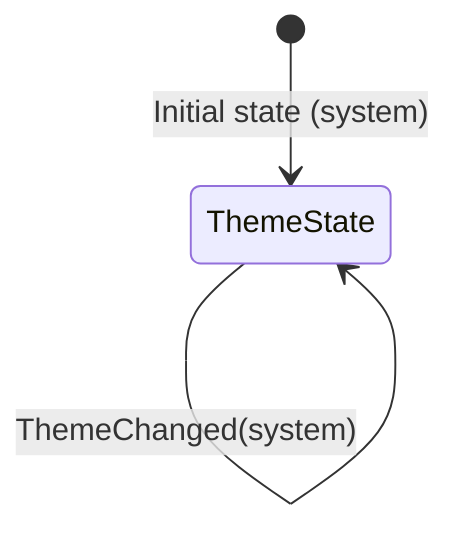
```mermaid
stateDiagram-v2
    [*] --> ThemeState: Initial state (system)
    ThemeState --> ThemeState: ThemeInitialized
    ThemeState --> ThemeState: ThemeChanged(light)
    ThemeState --> ThemeState: ThemeChanged(dark)
    ThemeState --> ThemeState: ThemeChanged(system)
```

## Network Architecture

### API Communication

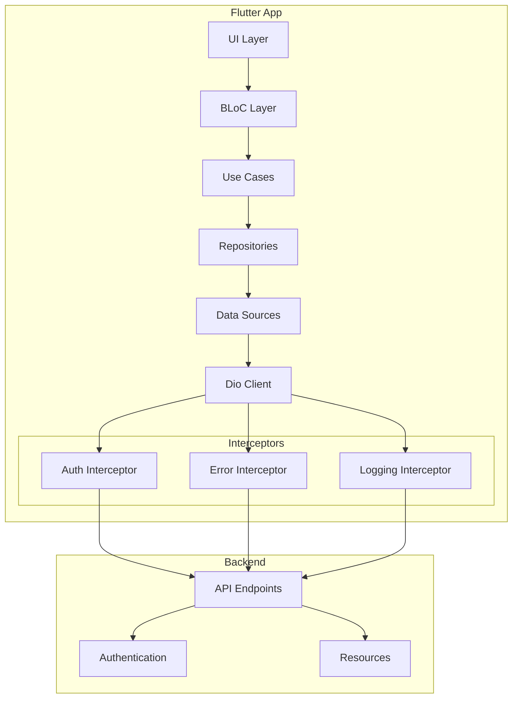
```mermaid
graph TD
    subgraph "Flutter App"
        UI[UI Layer]
        BLoC[BLoC Layer]
        UseCase[Use Cases]
        Repo[Repositories]
        DataSource[Data Sources]
        DioClient[Dio Client]
        
        subgraph "Interceptors"
            AuthInt[Auth Interceptor]
            ErrorInt[Error Interceptor]
            LoggingInt[Logging Interceptor]
        end
    end
    
    subgraph "Backend"
        API[API Endpoints]
        Auth[Authentication]
        Resources[Resources]
    end
    
    UI --> BLoC
    BLoC --> UseCase
    UseCase --> Repo
    Repo --> DataSource
    DataSource --> DioClient
    DioClient --> AuthInt
    DioClient --> ErrorInt
    DioClient --> LoggingInt
    AuthInt --> API
    ErrorInt --> API
    LoggingInt --> API
    API --> Auth
    API --> Resources
```

### Error Handling Flow

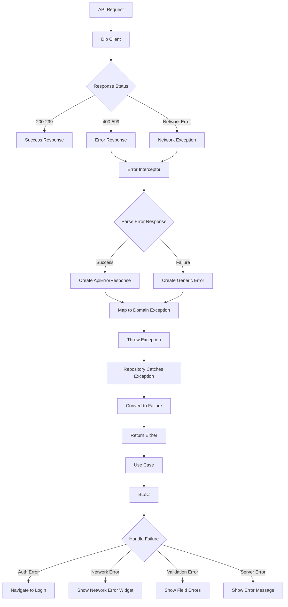
```mermaid
graph TD
    A[API Request] --> B[Dio Client]
    B --> C{Response Status}
    C -->|200-299| D[Success Response]
    C -->|400-599| E[Error Response]
    C -->|Network Error| F[Network Exception]
    
    E --> G[Error Interceptor]
    F --> G
    
    G --> H{Parse Error Response}
    H -->|Success| I[Create ApiErrorResponse]
    H -->|Failure| J[Create Generic Error]
    
    I --> K[Map to Domain Exception]
    J --> K
    
    K --> L[Throw Exception]
    L --> M[Repository Catches Exception]
    M --> N[Convert to Failure]
    N --> O[Return Either<Failure, T>]
    O --> P[Use Case]
    P --> Q[BLoC]
    Q --> R{Handle Failure}
    R -->|Auth Error| S[Navigate to Login]
    R -->|Network Error| T[Show Network Error Widget]
    R -->|Validation Error| U[Show Field Errors]
    R -->|Server Error| V[Show Error Message]
```

## Deployment Architecture

### CI/CD Pipeline

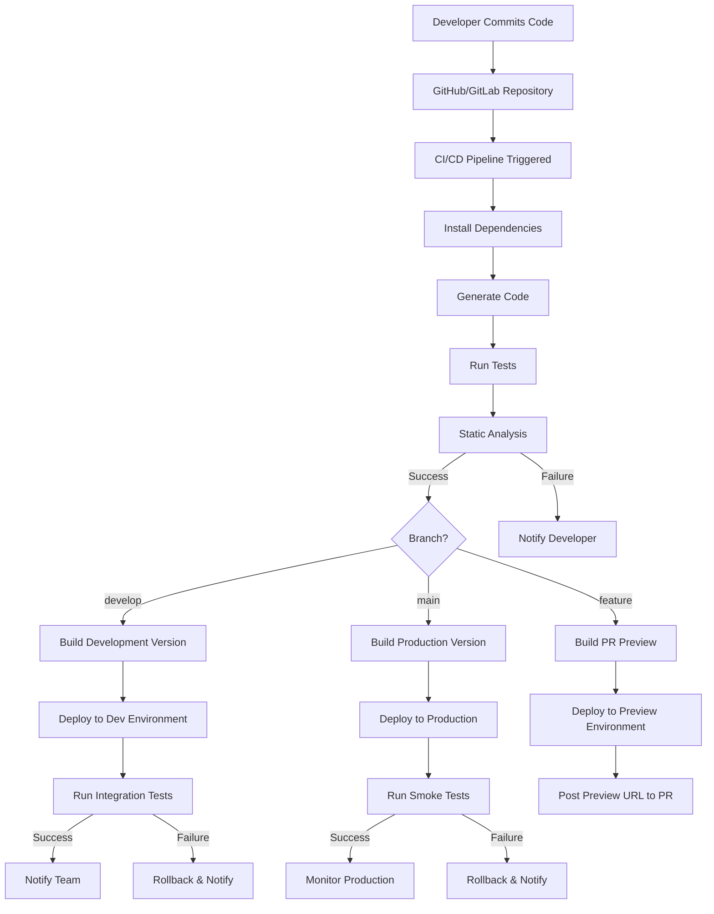
```mermaid
graph TD
    A[Developer Commits Code] --> B[GitHub/GitLab Repository]
    B --> C[CI/CD Pipeline Triggered]
    
    C --> D[Install Dependencies]
    D --> E[Generate Code]
    E --> F[Run Tests]
    F --> G[Static Analysis]
    
    G -->|Success| H{Branch?}
    G -->|Failure| Z[Notify Developer]
    
    H -->|develop| I[Build Development Version]
    H -->|main| J[Build Production Version]
    H -->|feature| K[Build PR Preview]
    
    I --> L[Deploy to Dev Environment]
    J --> M[Deploy to Production]
    K --> N[Deploy to Preview Environment]
    
    L --> O[Run Integration Tests]
    M --> P[Run Smoke Tests]
    
    O -->|Success| Q[Notify Team]
    O -->|Failure| R[Rollback & Notify]
    
    P -->|Success| S[Monitor Production]
    P -->|Failure| T[Rollback & Notify]
    
    N --> U[Post Preview URL to PR]
```

### Application Architecture

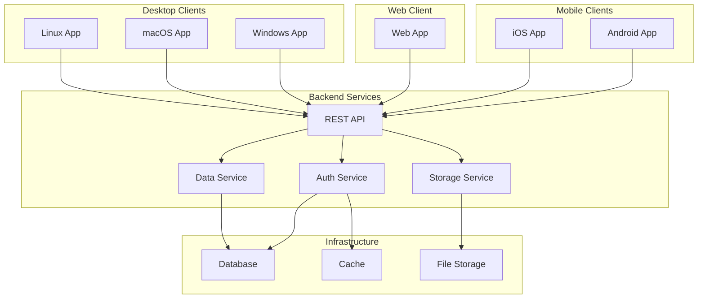
```mermaid
graph TD
    subgraph "Mobile Clients"
        Android[Android App]
        iOS[iOS App]
    end
    
    subgraph "Web Client"
        Web[Web App]
    end
    
    subgraph "Desktop Clients"
        Windows[Windows App]
        macOS[macOS App]
        Linux[Linux App]
    end
    
    subgraph "Backend Services"
        API[REST API]
        Auth[Auth Service]
        Data[Data Service]
        Storage[Storage Service]
    end
    
    subgraph "Infrastructure"
        DB[Database]
        Cache[Cache]
        FileStorage[File Storage]
    end
    
    Android --> API
    iOS --> API
    Web --> API
    Windows --> API
    macOS --> API
    Linux --> API
    
    API --> Auth
    API --> Data
    API --> Storage
    
    Auth --> DB
    Auth --> Cache
    Data --> DB
    Storage --> FileStorage
```

## Feature Workflows

### User Registration Flow

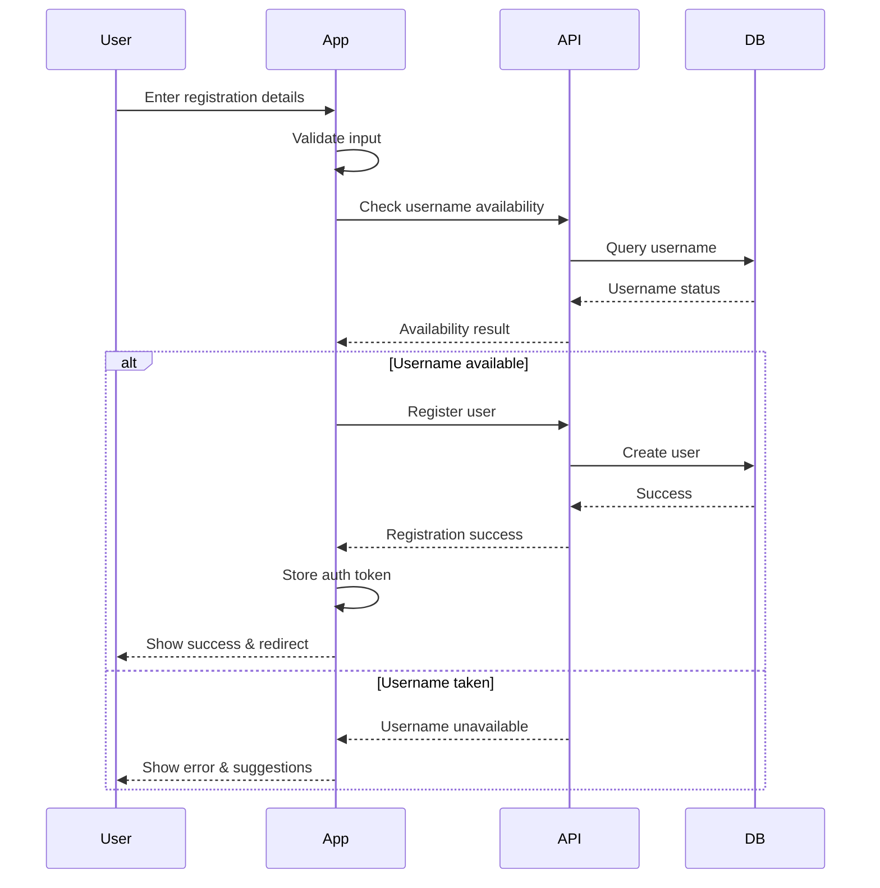
```mermaid
sequenceDiagram
    participant User
    participant App
    participant API
    participant DB
    
    User->>App: Enter registration details
    App->>App: Validate input
    App->>API: Check username availability
    API->>DB: Query username
    DB-->>API: Username status
    API-->>App: Availability result
    
    alt Username available
        App->>API: Register user
        API->>DB: Create user
        DB-->>API: Success
        API-->>App: Registration success
        App->>App: Store auth token
        App-->>User: Show success & redirect
    else Username taken
        API-->>App: Username unavailable
        App-->>User: Show error & suggestions
    end
```

### Data Synchronization Workflow

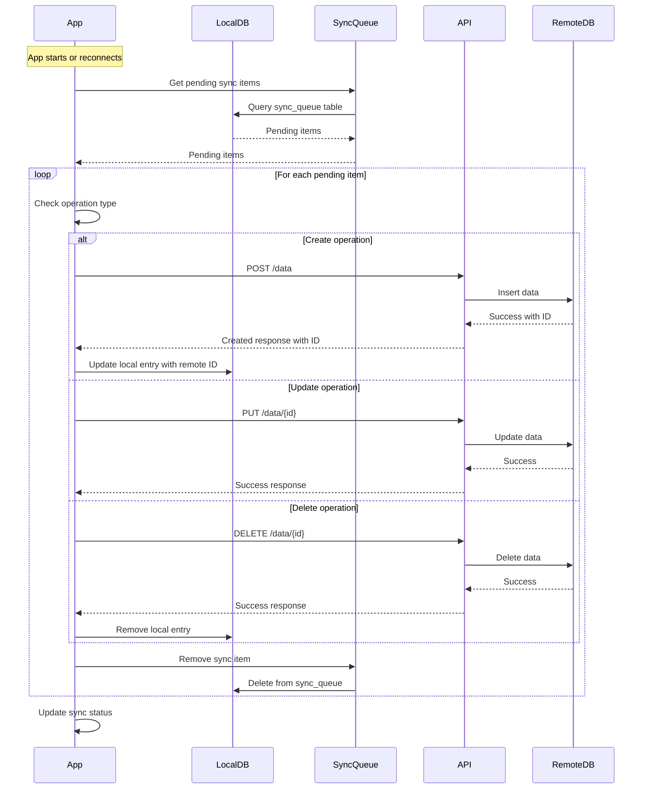
```mermaid
sequenceDiagram
    participant App
    participant LocalDB
    participant SyncQueue
    participant API
    participant RemoteDB
    
    Note over App: App starts or reconnects
    App->>SyncQueue: Get pending sync items
    SyncQueue->>LocalDB: Query sync_queue table
    LocalDB-->>SyncQueue: Pending items
    SyncQueue-->>App: Pending items
    
    loop For each pending item
        App->>App: Check operation type
        
        alt Create operation
            App->>API: POST /data
            API->>RemoteDB: Insert data
            RemoteDB-->>API: Success with ID
            API-->>App: Created response with ID
            App->>LocalDB: Update local entry with remote ID
        else Update operation
            App->>API: PUT /data/{id}
            API->>RemoteDB: Update data
            RemoteDB-->>API: Success
            API-->>App: Success response
        else Delete operation
            App->>API: DELETE /data/{id}
            API->>RemoteDB: Delete data
            RemoteDB-->>API: Success
            API-->>App: Success response
            App->>LocalDB: Remove local entry
        end
        
        App->>SyncQueue: Remove sync item
        SyncQueue->>LocalDB: Delete from sync_queue
    end
    
    App->>App: Update sync status
```

## Mobile-Specific Architecture

### Platform Integration

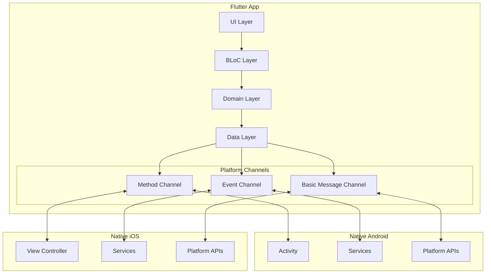
```mermaid
graph TD
    subgraph "Flutter App"
        UI[UI Layer]
        BLoC[BLoC Layer]
        Domain[Domain Layer]
        Data[Data Layer]
        
        subgraph "Platform Channels"
            MethodChannel[Method Channel]
            EventChannel[Event Channel]
            BasicMessageChannel[Basic Message Channel]
        end
    end
    
    subgraph "Native Android"
        AndroidActivity[Activity]
        AndroidServices[Services]
        AndroidAPIs[Platform APIs]
    end
    
    subgraph "Native iOS"
        iOSViewController[View Controller]
        iOSServices[Services]
        iOSAPIs[Platform APIs]
    end
    
    UI --> BLoC
    BLoC --> Domain
    Domain --> Data
    Data --> MethodChannel
    Data --> EventChannel
    Data --> BasicMessageChannel
    
    MethodChannel <--> AndroidActivity
    MethodChannel <--> iOSViewController
    EventChannel <--> AndroidServices
    EventChannel <--> iOSServices
    BasicMessageChannel <--> AndroidAPIs
    BasicMessageChannel <--> iOSAPIs
```

### Secure Storage Implementation

```mermaid
graph TD
    subgraph "Flutter App"
        SecureStorage[Secure Storage Interface]
        SecureStorageImpl[Secure Storage Implementation]
        FlutterSecureStorage[Flutter Secure Storage]
    end
    
    subgraph "Android"
        EncryptedSharedPrefs[Encrypted Shared Preferences]
        AndroidKeyStore[Android Keystore]
    end
    
    subgraph "iOS"
        Keychain[iOS Keychain]
        iOSSecurityFramework[Security Framework]
    end
    
    SecureStorage <|-- SecureStorageImpl
    SecureStorageImpl --> FlutterSecureStorage
    FlutterSecureStorage --> EncryptedSharedPrefs
    FlutterSecureStorage --> Keychain
    EncryptedSharedPrefs --> AndroidKeyStore
    Keychain --> iOSSecurityFramework
```

These diagrams provide a comprehensive visual representation of the SPB Secure Flutter application's architecture, workflows, and component interactions. They serve as valuable documentation for understanding the system design and implementation details.