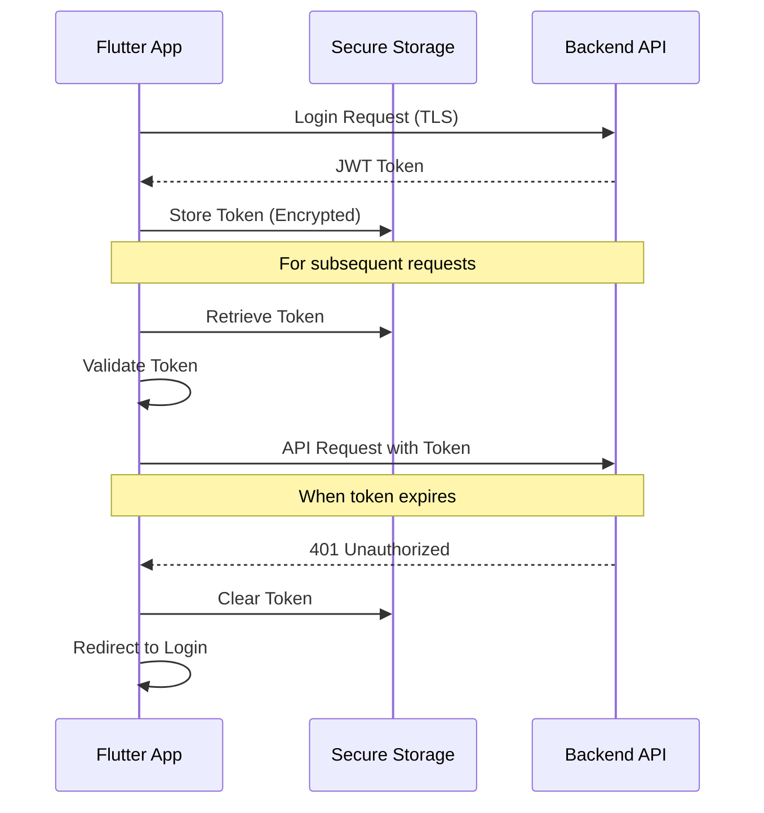

# Security Documentation

## Overview

This document outlines the security architecture, practices, and guidelines for the SPB Secure Flutter application. It covers authentication, data protection, network security, and secure coding practices.

## Security Architecture

### Authentication Security

#### JWT Token Management

The application uses JSON Web Tokens (JWT) for authentication with the following security measures:

```dart
// JWT Token Storage
final tokenManager = getIt<JwtTokenManager>();
await tokenManager.storeAndExtractToken(accessToken);

// Token Validation
final isValid = JwtDecoderUtil.isTokenValid(token);

// Token Extraction (filtered for security)
final userData = JwtDecoderUtil.extractUserInfo(token);
```

Key security features:
- **Secure Storage**: Tokens stored using platform-specific encryption
- **Automatic Expiration**: Tokens automatically checked for expiration
- **Filtered Claims**: Sensitive data filtered from decoded tokens
- **No Refresh Tokens**: Simplified security model with re-authentication

#### Authentication Flow Security



#### Token Security Measures

1. **Token Validation**
   ```dart
   // Before using token
   if (!JwtDecoderUtil.isTokenValid(token)) {
     // Handle invalid token
     await tokenManager.clearStoredToken();
     // Redirect to login
   }
   ```

2. **Token Storage**
   ```dart
   // Platform-specific secure storage
   const secureStorage = FlutterSecureStorage(
     aOptions: AndroidOptions(
       encryptedSharedPreferences: true,
     ),
     iOptions: IOSOptions(
       accessibility: KeychainAccessibility.first_unlock_this_device,
     ),
   );
   ```

3. **Token Interception**
   ```dart
   // Automatic token attachment to requests
   class AuthInterceptor extends Interceptor {
     @override
     void onRequest(RequestOptions options, RequestInterceptorHandler handler) async {
       final token = await _secureStorage.read(StorageKeys.accessToken);
       if (token != null && !JwtDecoder.isExpired(token)) {
         options.headers['Authorization'] = 'Bearer $token';
       }
       handler.next(options);
     }
   }
   ```

### Data Security

#### Secure Storage

The application uses a layered approach to data storage security:

1. **Sensitive Data**: Stored using `flutter_secure_storage`
   ```dart
   // Secure storage for sensitive data
   await secureStorage.write(key: 'access_token', value: token);
   ```

2. **User Preferences**: Stored using `shared_preferences`
   ```dart
   // Non-sensitive preferences
   await prefs.setString('theme_mode', themeMode.name);
   ```

3. **Application Data**: Stored in SQLite with proper indexing and constraints
   ```dart
   // Database schema with security measures
   await db.execute('''
     CREATE TABLE users (
       id TEXT PRIMARY KEY,
       username TEXT UNIQUE NOT NULL,
       email TEXT UNIQUE NOT NULL,
       name TEXT NOT NULL,
       avatar TEXT,
       created_at INTEGER NOT NULL,
       updated_at INTEGER NOT NULL,
       synced_at INTEGER NOT NULL DEFAULT (strftime('%s', 'now'))
     )
   ''');
   ```

#### Data Encryption

1. **At Rest Encryption**
   - Android: AES encryption via EncryptedSharedPreferences
   - iOS: Keychain with appropriate protection level
   - SQLite: Platform-specific database encryption

2. **In Memory Protection**
   ```dart
   // Clear sensitive data from memory
   @override
   void dispose() {
     _passwordController.clear();
     _passwordController.dispose();
     super.dispose();
   }
   ```

3. **Secure Deletion**
   ```dart
   // Secure logout
   Future<void> secureLogout() async {
     await tokenManager.clearStoredToken();
     await secureStorage.deleteAll();
     // Clear in-memory data
     // ...
   }
   ```

### Network Security

#### TLS Configuration

```dart
// Enforcing HTTPS in production
static void _validateUrl(String url) {
  final uri = Uri.tryParse(url);
  if (uri == null) {
    throw EnvironmentConfigException('Invalid URL format: $url');
  }

  // Ensure HTTPS in production
  if (_currentEnvironment == Environment.production && uri.scheme != 'https') {
    throw EnvironmentConfigException(
      'Production environment requires HTTPS URLs. Got: ${uri.scheme}'
    );
  }
}
```

#### Certificate Pinning

```dart
// Certificate pinning implementation
class CertificatePinningInterceptor extends Interceptor {
  final List<String> allowedSHAFingerprints;
  
  CertificatePinningInterceptor({required this.allowedSHAFingerprints});
  
  @override
  void onRequest(RequestOptions options, RequestInterceptorHandler handler) {
    // Certificate pinning logic
    // ...
    
    handler.next(options);
  }
}
```

#### API Security Headers

```dart
// Security headers for API requests
BaseOptions(
  headers: {
    'Content-Type': 'application/json',
    'Accept': 'application/json',
    'X-Requested-With': 'XMLHttpRequest',
    'X-Client-Version': '1.0.0',
    'X-Platform': 'flutter',
  },
)
```

### Error Handling Security

```dart
// Secure error handling
class ErrorInterceptor extends Interceptor {
  @override
  void onError(DioException err, ErrorInterceptorHandler handler) {
    // Create sanitized error response
    final apiErrorResponse = _createSanitizedErrorResponse(err);
    
    // Log error without sensitive data
    _logSecureError(err, apiErrorResponse);
    
    // Return sanitized error to user
    final enhancedException = DioException(
      requestOptions: err.requestOptions,
      error: AppException(apiErrorResponse.message),
      type: err.type,
      response: err.response,
      message: apiErrorResponse.message,
    );
    
    handler.reject(enhancedException);
  }
  
  // Create error response without sensitive data
  ApiErrorResponse _createSanitizedErrorResponse(DioException err) {
    // ...
  }
  
  // Log error securely
  void _logSecureError(DioException err, ApiErrorResponse apiErrorResponse) {
    // Redact sensitive information
    final redactedUrl = _redactSensitiveUrlParams(err.requestOptions.uri.toString());
    AppLogger.error('API Error: $redactedUrl');
    // ...
  }
  
  // Redact sensitive URL parameters
  String _redactSensitiveUrlParams(String url) {
    final uri = Uri.parse(url);
    final sensitiveParams = ['token', 'password', 'key', 'secret'];
    
    final redactedParams = Map<String, String>.from(uri.queryParameters);
    for (final param in sensitiveParams) {
      if (redactedParams.containsKey(param)) {
        redactedParams[param] = '***REDACTED***';
      }
    }
    
    return uri.replace(queryParameters: redactedParams).toString();
  }
}
```

## Secure Coding Practices

### Input Validation

```dart
// Username validation
class UserNameValidator {
  static final RegExp _validPattern = RegExp(r'^[a-zA-Z0-9_-]+$');

  static String? validateFormat(String? userName) {
    if (userName == null || userName.isEmpty) {
      return 'Username is required';
    }

    if (userName.length < minLength) {
      return 'Username must be at least $minLength characters long';
    }

    if (userName.length > maxLength) {
      return 'Username must be no more than $maxLength characters long';
    }

    if (!_validPattern.hasMatch(userName)) {
      return 'Username can only contain letters, numbers, underscore, and hyphen';
    }

    return null; // Valid userName
  }
}
```

### Secure Dependencies

Regular security audits of dependencies:

```bash
# Check for vulnerable dependencies
flutter pub outdated

# Update dependencies
flutter pub upgrade --major-versions

# Dependency analysis
flutter pub deps
```

### Code Obfuscation

```bash
# Build with obfuscation
flutter build apk --release --obfuscate --split-debug-info=build/debug-info
flutter build ios --release --obfuscate --split-debug-info=build/debug-info
```

### Secure Logging

```dart
// Secure logging implementation
class AppLogger {
  static void error(String message, [dynamic error, StackTrace? stackTrace]) {
    // Redact sensitive information
    final redactedMessage = _redactSensitiveData(message);
    _logger.e(redactedMessage, error: error, stackTrace: stackTrace);
  }
  
  // Redact sensitive data patterns
  static String _redactSensitiveData(String message) {
    // Redact JWT tokens
    final jwtPattern = RegExp(r'eyJ[a-zA-Z0-9_-]+\.[a-zA-Z0-9_-]+\.[a-zA-Z0-9_-]+');
    var redacted = message.replaceAllMapped(jwtPattern, (match) => '***JWT_REDACTED***');
    
    // Redact passwords
    final passwordPattern = RegExp(r'password["\']?\s*[:=]\s*["\']?[^"\',\s]+["\']?', caseSensitive: false);
    redacted = redacted.replaceAllMapped(passwordPattern, (match) => 'password: "***REDACTED***"');
    
    // Redact API keys
    final apiKeyPattern = RegExp(r'api[_-]?key["\']?\s*[:=]\s*["\']?[^"\',\s]+["\']?', caseSensitive: false);
    redacted = redacted.replaceAllMapped(apiKeyPattern, (match) => 'api_key: "***REDACTED***"');
    
    return redacted;
  }
}
```

## Security Testing

### Static Analysis

```bash
# Run Flutter analyze
flutter analyze

# Run custom security lints
flutter pub run custom_lint

# Check for hardcoded secrets
grep -r --include="*.dart" "const.*secret\|const.*key\|const.*password" lib/
```

### Dependency Scanning

```bash
# Install dependency scanner
dart pub global activate dependency_validator

# Run dependency scan
dependency_validator
```

### Security Testing Tools

1. **Mobile Security Framework (MobSF)**
   ```bash
   # Install MobSF
   git clone https://github.com/MobSF/Mobile-Security-Framework-MobSF.git
   cd Mobile-Security-Framework-MobSF
   ./setup.sh
   
   # Run MobSF
   ./run.sh
   
   # Upload APK for analysis at http://localhost:8000
   ```

2. **OWASP ZAP for API Testing**
   ```bash
   # Run ZAP Docker container
   docker run -p 8080:8080 -p 8090:8090 -i owasp/zap2docker-stable zap-webswing.sh
   
   # Access ZAP at http://localhost:8080/zap/
   ```

## Compliance

### GDPR Compliance

1. **Data Collection Transparency**
   ```dart
   // Privacy policy dialog
   void showPrivacyPolicy(BuildContext context) {
     showDialog(
       context: context,
       builder: (context) => AlertDialog(
         title: const Text('Privacy Policy'),
         content: SingleChildScrollView(
           child: Column(
             crossAxisAlignment: CrossAxisAlignment.start,
             children: [
               const Text('Data Collection'),
               // Privacy policy content
             ],
           ),
         ),
         actions: [
           TextButton(
             onPressed: () => Navigator.pop(context),
             child: const Text('Close'),
           ),
         ],
       ),
     );
   }
   ```

2. **Data Export**
   ```dart
   // Export user data
   Future<void> exportUserData() async {
     final userRepository = getIt<UserRepository>();
     final result = await userRepository.exportUserData();
     
     result.fold(
       (failure) => showError('Failed to export data'),
       (data) => saveDataToFile(data),
     );
   }
   ```

3. **Data Deletion**
   ```dart
   // Delete user account
   Future<void> deleteUserAccount() async {
     final userRepository = getIt<UserRepository>();
     final result = await userRepository.deleteAccount();
     
     result.fold(
       (failure) => showError('Failed to delete account'),
       (_) => navigateToLogin(),
     );
   }
   ```

### OWASP Mobile Top 10 Mitigations

1. **M1: Improper Platform Usage**
   - Use platform-specific security features
   - Follow platform guidelines for data storage

2. **M2: Insecure Data Storage**
   - Use `flutter_secure_storage` for sensitive data
   - Implement proper encryption for local databases

3. **M3: Insecure Communication**
   - Enforce HTTPS in production
   - Implement certificate pinning
   - Validate server certificates

4. **M4: Insecure Authentication**
   - Implement proper JWT token handling
   - Use secure authentication flows
   - Enforce strong password policies

5. **M5: Insufficient Cryptography**
   - Use modern cryptographic algorithms
   - Implement proper key management
   - Follow platform-specific encryption best practices

6. **M6: Insecure Authorization**
   - Implement proper role-based access control
   - Validate permissions on both client and server
   - Use principle of least privilege

7. **M7: Client Code Quality**
   - Follow secure coding practices
   - Implement proper error handling
   - Use static analysis tools

8. **M8: Code Tampering**
   - Implement code obfuscation
   - Use app signing
   - Implement integrity checks

9. **M9: Reverse Engineering**
   - Obfuscate code
   - Hide sensitive logic in API calls
   - Implement anti-debugging measures

10. **M10: Extraneous Functionality**
    - Remove debug code in production
    - Disable developer features in release builds
    - Implement proper feature flags

## Security Incident Response

### Incident Categories

1. **Data Breach**: Unauthorized access to user data
2. **Authentication Bypass**: Unauthorized access to protected features
3. **API Vulnerability**: Security issues in API endpoints
4. **Client Vulnerability**: Security issues in client application
5. **Third-Party Vulnerability**: Security issues in dependencies

### Response Process

1. **Detection**
   - Monitor application logs
   - Review user reports
   - Analyze security alerts

2. **Containment**
   - Isolate affected systems
   - Block compromised accounts
   - Disable vulnerable features

3. **Eradication**
   - Fix security vulnerabilities
   - Update affected components
   - Release security patches

4. **Recovery**
   - Restore affected systems
   - Verify security fixes
   - Monitor for recurring issues

5. **Post-Incident Analysis**
   - Document incident details
   - Identify root causes
   - Implement preventive measures

### Security Contact

- **Security Email**: security@spb-secure.com
- **Bug Bounty Program**: https://hackerone.com/spb-secure
- **Responsible Disclosure**: https://spb-secure.com/security

## Security Updates

### Update Process

1. **Vulnerability Assessment**
   - Identify affected components
   - Assess impact and severity
   - Determine fix priority

2. **Fix Development**
   - Develop security patches
   - Test fixes thoroughly
   - Prepare release notes

3. **Deployment**
   - Release security updates
   - Notify users
   - Monitor deployment

### Update Channels

- **Critical Updates**: Immediate release
- **Security Patches**: Monthly release
- **Regular Updates**: Quarterly release

## Security Best Practices for Users

### Secure Authentication

- Use strong, unique passwords
- Enable biometric authentication if available
- Log out from shared devices

### Data Protection

- Keep the app updated
- Don't share sensitive information
- Review app permissions

### Secure Communication

- Use secure networks
- Avoid public Wi-Fi for sensitive operations
- Verify SSL certificates

## Security Resources

### Documentation

- [Flutter Security Best Practices](https://flutter.dev/security)
- [OWASP Mobile Security Testing Guide](https://owasp.org/www-project-mobile-security-testing-guide/)
- [NIST Mobile Application Security Guidelines](https://csrc.nist.gov/publications/detail/sp/800-163/rev-1/final)

### Tools

- [MobSF (Mobile Security Framework)](https://github.com/MobSF/Mobile-Security-Framework-MobSF)
- [OWASP ZAP (Zed Attack Proxy)](https://www.zaproxy.org/)
- [Dependency-Check](https://owasp.org/www-project-dependency-check/)

### Training

- [OWASP Mobile Security Testing](https://owasp.org/www-project-mobile-security-testing-guide/)
- [Secure Coding in Flutter](https://flutter.dev/docs/development/security)
- [API Security Best Practices](https://owasp.org/www-project-api-security/)

This security documentation provides a comprehensive overview of the security measures implemented in the SPB Secure Flutter application, ensuring that developers and users understand the security architecture and best practices.